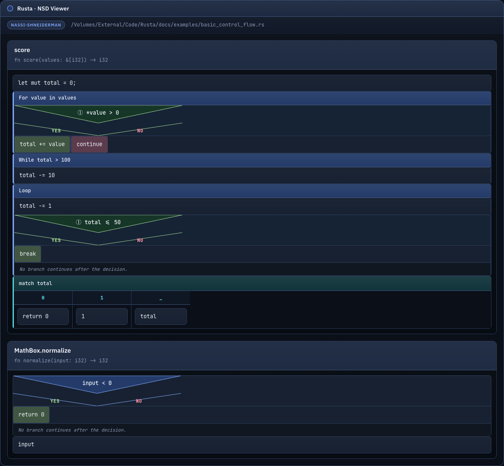
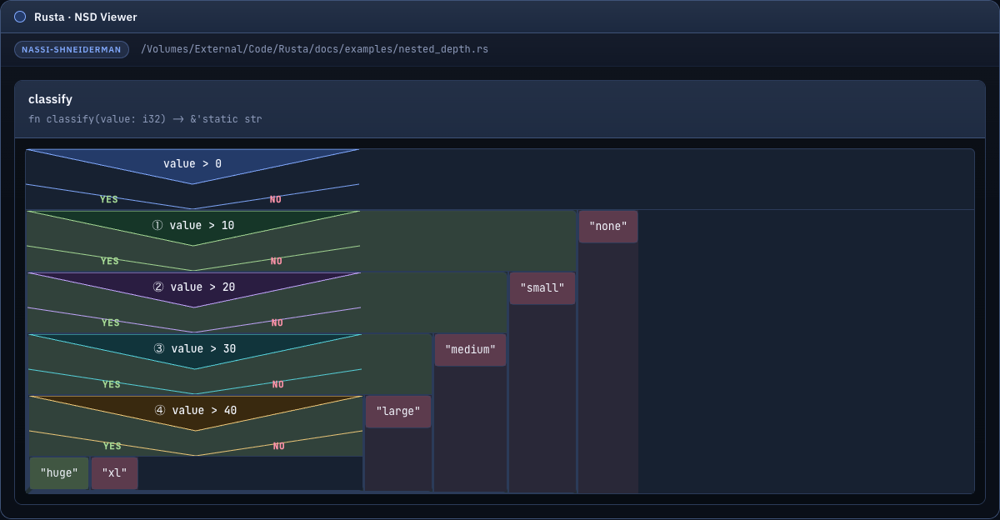

# Rusta

Rusta is a small layered parser service for Rust source code built on top of ANTLR4 and Python bindings.

The repo keeps the same general architecture as the earlier parser iteration:

* domain-first, layered monolith
* ANTLR grammar kept behind infrastructure ports
* CLI contract that parses one file or a whole directory and returns versioned JSON
* generated Python parser artifacts committed locally from vendored upstream grammar inputs

The import path and console script are now both `rusta`.

## What It Parses

Today the parser recognizes Rust source files (`.rs`) and extracts a lightweight structural dictionary with:

* `use`
* `module`
* `type_alias`
* `constant`
* `static`
* `function`
* `struct`
* `enum`
* `union`
* `trait`
* `impl`

Syntax diagnostics from the ANTLR lexer/parser are included in the JSON report.

## Nassi Diagrams

The Rust Nassi-Shneiderman renderer currently builds diagrams for common function-level control flow:

* `let` statements
* expression actions
* `if` and `if let`
* `while` and `while let`
* `for`
* `loop`
* `match`
* `return`, `break`, and `continue` as action nodes

For directory mode, the CLI writes one HTML file per Rust source file plus an `index.html` bundle page.

### Demo Screenshots

Basic control flow:



Nested depth:



## Grammar Source

The Rust grammar is vendored from [`antlr/grammars-v4`](https://github.com/antlr/grammars-v4/tree/master/rust).

Included locally:

* [resources/grammars/rust/RustLexer.g4](/Volumes/External/Code/Rusta/resources/grammars/rust/RustLexer.g4)
* [resources/grammars/rust/RustParser.g4](/Volumes/External/Code/Rusta/resources/grammars/rust/RustParser.g4)
* [resources/grammars/rust/Python3/RustLexerBase.py](/Volumes/External/Code/Rusta/resources/grammars/rust/Python3/RustLexerBase.py)
* [resources/grammars/rust/Python3/RustParserBase.py](/Volumes/External/Code/Rusta/resources/grammars/rust/Python3/RustParserBase.py)
* [resources/grammars/rust/Python3/transformGrammar.py](/Volumes/External/Code/Rusta/resources/grammars/rust/Python3/transformGrammar.py)

The upstream Rust grammar README says it was last updated for Rust `v1.60.0` and targets stable `2018+` syntax.

## Quick Start

1. Install dependencies:

```bash
uv sync --extra dev
```

2. Generate Python parser artifacts from the vendored Rust grammar:

```bash
uv run python scripts/generate_rust_parser.py
```

3. Parse one Rust file:

```bash
uv run rusta parse-file path/to/lib.rs
```

4. Parse a directory of Rust files:

```bash
uv run rusta parse-dir path/to/project
```

5. Build a Nassi-Shneiderman HTML diagram for one Rust file:

```bash
uv run rusta nassi-file path/to/lib.rs --out output/lib.nassi.html
```

6. Build diagram bundles for a Rust source directory:

```bash
uv run rusta nassi-dir path/to/project --out output/nassi-bundle
```

If you run the module directly instead of `uv run`, make sure `src` is on `PYTHONPATH`.

## Output Contract

The CLI returns JSON with:

* job metadata
* summary counters
* one report per source file
* syntax diagnostics
* structural elements with `kind`, `name`, `line`, `column`, `container`, and `signature`
* token/statistics metadata

For `nassi-file` and `nassi-dir`, the CLI returns JSON metadata describing the generated HTML outputs.

## Current Scope

The active CLI supports both structural parsing and Rust-oriented Nassi-Shneiderman diagram generation for single files and whole directories.
